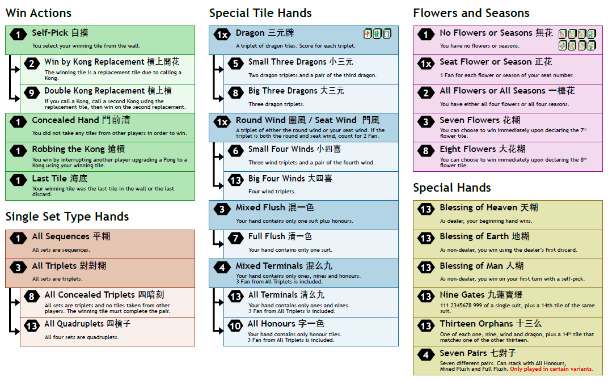

==================================
Gameplay and Scoring Rules
==================================

How a Player's Turn Works
-------------------------
Play flows counter-clockwise. The hand starts when the Dealer discards a 14th tile into the center pool.

On your turn, follow this sequence:

1. **Draw:** Take one tile from the open end of the Live Wall.
2. **Handle Special Tiles:** If you draw a Flower or complete a Quadruplet, declare it, place it open, and draw a replacement from the Dead Wall. Repeat if necessary.
3. **Check for Win:** If the drawn tile completes your 14-tile hand, declare a self-pick win by calling **"Ji Mo!" (自摸)** and lay your hand open.
4. **Discard:** If you cannot win, select one unwanted tile from your hand and discard it face up into the center pool.

Declaring Kongs on Your Turn
~~~~~~~~~~~~~~~~~~~~~~~~~~~~
You can declare a Quadruplet (Kong) on your turn under two circumstances:

* **Concealed Kong (暗槓):** You hold 3 identical hidden tiles in your hand and draw the 4th matching tile from the wall. Reveal them with the two middle tiles face-down to show the hand remains structurally concealed.
* **Promoted Kong (加槓):** You have an already revealed triplet (Pong) on the table and draw the 4th matching tile from the wall. Add it to your open set.

Interacting with Discards (Meld Actions)
----------------------------------------
When another player discards a tile, you can interrupt the normal order of play if it completes a set in your hand. 

The legal meld choices are ranked by priority:

1. **Sik / Seung (吃 / 上 - Sequence):** If you hold two suited tiles that can form a sequence with the discard, you can claim it **ONLY if it came from the player directly to your left**. Announce "Seung," reveal your two tiles, and place the completed set face up.
2. **Pong (碰 - Triplet):** If you hold two identical hidden tiles, you can claim a matching third tile **from any player's discard**. Announce "Pong" and lay the triplet face up. This takes priority over a Seung call.
3. **Kong (槓 - Open Quadruplet):** If you hold three identical hidden tiles, you can claim the fourth **from any player's discard**. Announce "Kong," lay all four face up, and draw a replacement tile from the Dead Wall.
4. **Sik Wu / Wu (食和 / 和 - Winning Discard):** If your hand is "Ready" (needing exactly one tile to complete your 14-tile dragon), you can claim that tile **from any player's discard** to win immediately. Announce "Sik Wu!". This takes absolute priority over all other calls.
5. **Cheung Kong (搶槓 - Robbing the Kong):** If an opponent attempts to upgrade an open Pong to a Promoted Kong using a tile you need for a win, you can intercept their tile to declare a "Sik Wu" discard victory.

Hand Status: Open vs. Concealed
-------------------------------

* **Concealed Hand:** You have not taken any tiles from other players' discards via Seung, Pong, or Open Kong. Your hand is still considered concealed if you declare a Concealed Kong, or if you win via an opponent's discard.
* **Open Hand:** As soon as you complete a meld using a public discard, your hand is permanently classified as open.

Mahjong Claim Precedence
------------------------
When a tile is discarded, multiple players may want to claim it. Claims are resolved based on the following strict order of precedence (highest priority to lowest):

1. Zi Mo (Win by Self-Pick)
2. Wu (Win)
3. Kong (Quadruplet) & Pong (Triplet)
4. Seung (Sequence)

Minimum Fan Requirements
------------------------
While beginners at Balai Hub may waive minimum requirements for practice, standard club play enforces a **1-Fan or 3-Fan minimum** to legally declare a win. A winning hand that contains absolutely zero scoring patterns is called a **Chicken Hand (雞和 - Gaai Wu)** and cannot win under minimum-Fan rules.

Balai Hub Official Fan Scoring Sheet
------------------------------------
Your hand's Total Fan Score is the sum of all matching features. Indented features completely replace their parent category (e.g., scoring a *Full Flush* means you do not count *Half Flush*).

.. note::
   
   * Unless stated otherwise, *triplets* and *quadruplets* are interchangeable.
   * Calculate your final score on the Score Table.

Scoring System (Discarder Pays All)
-----------------------------------
Balai Hub utilizes the traditional **"Discarder Pays All" (全銃制)** penalty framework to increase tactical accountability:

* **Winning by Self-Pick (自摸):** All three losing players lose half the base point value listed on the Score Table below matching your Fan total, however no points will be deducted for **0 Fan**.
* **Winning by Discard (食和):** The player who discarded the winning tile must single-handedly lose **the listed point value**, while the other two innocent players lose none.

.. list-table:: Score Table
   :widths: 20 30 20 30
   :header-rows: 1

   * - Fan Count
     - Base Scoring Points
     - Fan Count
     - Base Scoring Points
   * - 0 Fan
     - 1 Point
     - 7 Fan
     - 48 Points
   * - 1 Fan
     - 2 Points
     - 8 Fan
     - 64 Points
   * - 2 Fan
     - 4 Points
     - 9 Fan
     - 96 Points
   * - 3 Fan
     - 8 Points
     - 10 Fan
     - 128 Points
   * - 4 Fan
     - 16 Points
     - 11 Fan
     - 192 Points
   * - 5 Fan
     - 24 Points
     - 12 Fan
     - 256 Points
   * - 6 Fan
     - 32 Points
     - 13+ Fan (Limit)
     - 384 Points

Gameplay Variants (Balai Hub)
----------------------------------------
We sometimes make the game more exciting and challenging by adding some classic requirements or changing some rules such as:

1. **Fan Requirement:** A *1-Fan or 3-Fan minimum* is enforced to legally declare a win.
2. **First Come First Serve:** Mahjong claim precedence is not enforced anymore, whoever calls then takes the tile first, gets the tile.