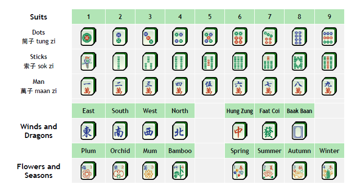

=============================
The Mahjong Tiles and Sets
=============================

The 144-Tile Set
----------------
A standard Hong Kong Mahjong set features exactly **144 tiles**. These tiles operate much like a specialized deck of playing cards, split into three suited classes, honour tiles, and optional bonus tiles.

The Three Suits
~~~~~~~~~~~~~~~
Each suit contains numbers from 1 through 9, with 4 duplicates of each individual tile (36 tiles per suit):

1. **Dots (筒子):** Represented by circular geometric patterns numbered 1 to 9.
2. **Sticks / Bamboos (索子):** Represented by bamboo stick indicators numbered 1 to 9. Note that the 1-Stick tile is traditionally illustrated as a bird.
3. **Characters (萬子):** Indicated by Chinese numeral characters underlined by the symbol for ten thousand (*Wan* / 萬).

Honour Tiles
~~~~~~~~~~~~
Honour tiles exist completely outside of the numerical suits and always consist of 4 identical duplicates each:

* **Winds (風牌):** East (東), South (南), West (西), and North (北).
* **Dragons (三元牌):** Red Dragon (中), Green Dragon (發), and White Dragon (白—typically stylized as a plain blank tile or a clean rectangle frame).

Flowers and Seasons
~~~~~~~~~~~~~~~~~~~
Flowers and Seasons are special, single-copy "bonus" tiles that unlock extra point multipliers if drawn:

* There are 4 unique Flower tiles and 4 unique Season tiles, distinctly color-coded in red and blue and numbered 1 through 4.
* Because there is only **1 of each unique tile** in the game, they cannot be melded into triplets or sequences.

Forming Legal Melds
-------------------
To organize your tiles into a winning "dragon," you must build sets of three or four tiles. Sets are limited to the following three valid structural types:

1. **Sequences (Chow / Seung):** Exactly three consecutively numbered tiles within the *same suit* (e.g., 2-3-4 of Sticks).
2. **Triplets (Pong):** Three completely identical tiles (e.g., three Red Dragons).
3. **Quadruplets (Kong):** Four completely identical tiles.

Strict Sequence Constraints
~~~~~~~~~~~~~~~~~~~~~~~~~~~
When managing or assembling sequences, players must closely observe these rules:

.. image:: images/sequence_rules.jpg
   :alt: Diagram of legal sequences versus illegal or broken formations
   :align: center

* **No Mixed Suits:** You cannot combine different suits to create a sequence (e.g., 7-Dots, 8-Sticks, 9-Characters is entirely illegal).
* **No Wraparounds:** Numerical runs cannot loop around the boundaries of 9 and 1 (e.g., 8-9-1 or 9-1-2 are invalid).
* **No Honour Sequences:** Honour tiles (Winds and Dragons) cannot form sequences under any circumstances (e.g., East-South-West is invalid).